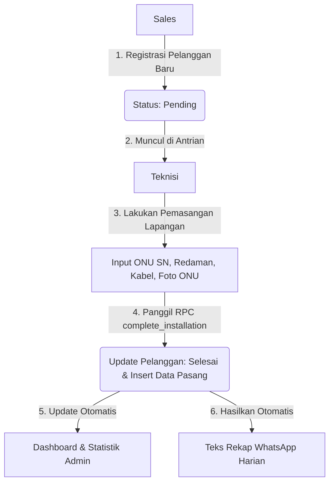

# DG-KOMPUTER — Sistem Manajemen Pelanggan Internet 🚀

Sebuah dashboard operasional terintegrasi kelas premium yang dirancang khusus untuk manajemen pelayanan pelanggan Internet Service Provider (ISP) skala kecil hingga menengah. Aplikasi ini mengintegrasikan seluruh alur kerja tim **Admin**, **Sales**, dan **Teknisi** ke dalam satu platform tersinkronisasi awan (cloud-sync). 

Tidak ada lagi pencatatan manual di spreadsheet yang tersebar, koordinasi yang terputus di obrolan chat pribadi, atau dokumentasi foto KTP & ONU yang hilang di galeri handphone. Satu sumber kebenaran data untuk seluruh anggota tim!

---

## 🎯 Kesimpulan Sistem

DG-KOMPUTER merupakan solusi **SaaS-Ready Internal Tool** yang menjembatani operasional harian ISP dari hulu ke hilir. Berbasis arsitektur modern **Serverless React** yang berpasangan dengan **Supabase**, aplikasi ini memastikan integritas data tinggi menggunakan **Row Level Security (RLS)** dan sinkronisasi real-time. 

Sistem ini mempercepat waktu respons instalasi pelanggan baru, mengotomatisasi pembuatan rekap laporan harian untuk grup WhatsApp koordinasi, serta memberikan visibilitas penuh kepada manajemen melalui analitik grafik interaktif.

---

## 🔑 Panduan Akses & Keamanan (Role-Based Access)

Aplikasi ini menerapkan **Role-Based Access Control (RBAC)** yang sangat ketat untuk melindungi data sensitif pelanggan (seperti foto KTP dan detail rumah). Berikut adalah pembagian wewenang berdasarkan peran pengguna:

### 👥 Struktur Hak Akses Menu & Halaman

| Fitur / Halaman | URL Path | ADMIN | SALES | TEKNISI | VIEWER | Deskripsi Operasional |
| :--- | :--- | :---: | :---: | :---: | :---: | :--- |
| **Dashboard** | `/` | ✅ | ✅ | ✅ | ✅ | Ringkasan harian, ranking sales, tren 14 hari, & aktivitas terbaru. |
| **Daftar Pelanggan** | `/pelanggan` | ✅ | ✅ | ✅ | ✅ | Daftar lengkap pelanggan dengan pencarian dan filter status. |
| **Registrasi Baru** | `/pelanggan/baru` | ✅ | ✅ | ❌ | ❌ | Form khusus pendaftaran pelanggan baru disertai upload KTP & Rumah. |
| **Antrian Teknisi** | `/antrian` | ✅ | ❌ | ✅ | ✅ | Daftar instalasi pending. Teknisi menginput hasil pasang & ONU. |
| **Statistik & Analitik** | `/statistik` | ✅ | ✅ | ✅ | ✅ | Grafik visualisasi paket terlaris, area top, dan komposisi tim. |
| **Log Aktivitas** | `/logs` | ✅ | ❌ | ❌ | ✅ | Audit trail mencatat log tindakan sensitif (siapa melakukan apa). |
| **Rekap WhatsApp** | `/rekap` | ✅ | ✅ | ❌ | ✅ | Generator teks laporan instan untuk dicopy-paste ke grup koordinasi. |
| **Profil Saya** | `/profil` | ✅ | ✅ | ✅ | ✅ | Pengaturan profil pribadi, performa personal 7 hari, dan histori aksi. |
| **Manajemen User** | `/users` | ✅ | ❌ | ❌ | ❌ | Mengatur dan mengubah level akses/role dari semua anggota tim. |
| **Paket Internet** | `/admin/packages` | ✅ | ❌ | ❌ | ❌ | CRUD Master Data Paket Internet (kecepatan, harga, warna tag). |
| **Jenis Pelanggan** | `/admin/customer-types` | ✅ | ❌ | ❌ | ❌ | CRUD Master Data Kategori Pelanggan (Rumahan, Bisnis, Instansi). |
| **Pengaturan Website** | `/admin/settings/general`| ✅ | ❌ | ❌ | ❌ | Konfigurasi global nama web, deskripsi SEO, branding logo & warna. |

> [!IMPORTANT]
> **Kebijakan Row Level Security (RLS) pada Database:**
> - **Sales** hanya dapat melihat, memperbarui, dan mengelola data pelanggan yang **mereka daftarkan sendiri** (kepemilikan `sales_id`).
> - **Teknisi** dapat melihat semua data pelanggan demi keperluan instalasi di lapangan, tetapi hanya bisa mengupdate data lewat fungsi khusus pemasangan.
> - **Viewer** memiliki akses baca (*read-only*) ke data pelanggan, antrian teknisi, dan statistik untuk kebutuhan monitoring, tanpa hak memodifikasi.
> - **Admin** memiliki akses penuh tanpa batas ke semua baris data di seluruh tabel.

### 🌐 Alur Pembuatan Akun & Akses Pertama
1. **Registrasi Akun Pertama:** Pengguna pertama yang mendaftar melalui halaman **Sign Up** secara otomatis akan dipromosikan menjadi **ADMIN** oleh sistem database trigger (`handle_new_user`).
2. **Pendaftar Berikutnya:** Semua pengguna yang mendaftar setelah pengguna pertama secara otomatis akan mendapatkan role default **VIEWER** demi alasan keamanan data.
3. **Promosi Role:** Pengguna baru harus meminta **ADMIN** untuk mengubah/mempromosikan role mereka (menjadi SALES atau TEKNISI) melalui halaman **Manajemen User** (`/users`) agar bisa mulai bekerja sesuai deskripsi pekerjaan masing-masing.

---

## ✨ Fitur-Fitur Utama Terperinci

Aplikasi ini bukan sekadar formulir input data (CRUD) biasa. Setiap modul dirancang secara presisi menyesuaikan kondisi kerja nyata di lapangan:

### 📊 1. Dashboard Monitoring & Visualisasi Data
* **Metrik Utama:** Menampilkan kartu ringkasan jumlah total pelanggan, pelanggan aktif, antrian pemasangan pending, serta persentase rasio instalasi sukses.
* **Sparkline Tren:** Setiap kartu metrik dilengkapi dengan grafik garis kecil (*sparkline*) instan yang menunjukkan arah perkembangan data 14 hari terakhir.
* **Ranking Sales:** Menampilkan performa tim sales secara transparan untuk memotivasi pencapaian target.
* **Aktivitas Terbaru:** Feed log aktivitas waktu nyata (real-time) yang menampilkan tindakan terakhir yang dilakukan oleh tim.

### 👥 2. Manajemen & Registrasi Pelanggan Baru (Sales-Oriented)
* **Pencarian & Filter Cepat:** Temukan pelanggan berdasarkan nama, nomor WhatsApp, wilayah area, jenis layanan, atau paket internet aktif.
* **Unggah Dokumen Privat:** Fitur drag-and-drop untuk mengunggah foto KTP fisik dan foto fasad rumah pelanggan. File disimpan secara aman di bucket privat **Supabase Storage** dan hanya bisa diakses menggunakan tanda tangan digital berdurasi terbatas (*signed URL*).
* **Validasi Skema Ketat:** Formulir pendaftaran divalidasi penuh menggunakan **Zod** untuk mencegah data tidak valid, kosong, atau nomor handphone salah format.

### 🔧 3. Antrian Pemasangan & Integrasi Teknisi (Field-Oriented)
* **Antrean Interaktif:** Kartu-kartu pelanggan berstatus `Pending` tersusun rapi menunggu penugasan teknisi.
* **Formulir Lapangan Terintegrasi:** Saat di lapangan, teknisi cukup membuka detail antrean lewat ponsel, menginput nomor serial modem (ONU SN), redaman kabel (dalam dBm), panjang kabel fiber yang terpakai, dan mengambil foto bukti pemasangan.
* **Transaksi Atomic (RPC):** Penyelesaian instalasi menggunakan database *Remote Procedure Call* (`complete_installation`). Menjamin pengisian data instalasi dan pembaruan status pelanggan menjadi `Selesai` terjadi dalam satu transaksi aman (jika satu gagal, semua dibatalkan).

### 💬 4. Generator Rekap Laporan WhatsApp
* **Otomatisasi Teks:** Tidak perlu lagi menulis laporan harian secara manual setiap malam. Sistem mendeteksi pemasangan selesai dan pendaftaran baru pada tanggal aktif.
* **Salin Satu Klik:** Menyusun laporan rapi terformat dengan emoji pendukung, siap disalin ke grup koordinasi WhatsApp hanya dengan menekan satu tombol.

### 📈 5. Statistik & Analitik Bisnis Mendalam
* **Tren Pertumbuhan:** Grafik area interaktif 30 hari terakhir yang menampilkan visualisasi pertumbuhan bisnis.
* **Distribusi Paket:** Donut chart yang memvisualisasikan paket internet mana yang paling diminati oleh pelanggan.
* **Distribusi Wilayah:** Bar chart horizontal yang mengurutkan 8 area teratas dengan konsentrasi pelanggan tertinggi.

### ⚙️ 6. Pengaturan Website & Branding Dinamis (Admin-Only)
* **Master Data Management:** Kelola paket internet aktif (`packages`) lengkap dengan label kecepatan Mbps, harga bulanan, dan warna tema kartu. Kelola juga kategori jenis pelanggan (`customer_types`).
* **Sistem Identitas & Branding:** Admin dapat mengunggah Logo website baru, Favicon, serta OG Image untuk kebutuhan metadata sharing.
* **Penyesuai Warna Utama (Theme Color Customizer):** Admin dapat mengubah warna primer seluruh aplikasi secara dinamis (menggunakan input color picker yang dikonversi ke format HSL CSS Variables). Perubahan ini langsung diaplikasikan ke tombol, badge, dan aksen navigasi seluruh user secara real-time.

---

## 🛠 Tech Stack (Teknologi yang Digunakan)

### 💻 Frontend
* **Core:** React 18 + TypeScript + Vite 5 (Ringan, responsif, waktu muat super cepat).
* **Styling:** Tailwind CSS v3 + **shadcn/ui** (Desain modern, antarmuka premium, konsisten, mendukung responsivitas perangkat mobile/tablet).
* **Routing:** React Router v6.
* **State & Caching:** TanStack Query v5 (Menjamin data tidak *stale*, auto-caching, efisiensi bandwidth).
* **Charts:** Recharts (Visualisasi grafik SVG yang halus dan responsif).
* **Icons:** Lucide React (Ikon vektor modern yang konsisten).

### ☁️ Backend & Infrastruktur (Lovable Cloud / Supabase)
* **Database:** PostgreSQL (Skema relasional yang tangguh, aman, dan cepat).
* **Security:** Row Level Security (RLS) diaktifkan secara menyeluruh di semua tabel database.
* **Authentication:** Supabase Auth (Manajemen session aman, persistensi otomatis).
* **Storage:** Bucket privat `customer-photos` dan bucket publik `branding`.
* **RPC (Remote Procedure Calls):** Menjalankan query kompleks multi-tabel di sisi server secara aman.

---

## 🚀 Cara Instalasi & Menjalankan Aplikasi di Local

Ikuti langkah mudah berikut untuk menduplikasi dan menjalankan aplikasi di komputer lokal Anda:

### 📋 Prasyarat
Pastikan Anda sudah menginstal Node.js (v18+) atau **Bun** (sangat disarankan karena lebih cepat).

### ⚙️ Langkah-langkah
```bash
# 1. Clone repositori ini ke lokal Anda
git clone <url-repositori-anda>
cd netcore-isp

# 2. Install seluruh dependensi yang dibutuhkan
# Jika menggunakan Bun (Disarankan):
bun install
# Atau jika menggunakan NPM:
npm install

# 3. Konfigurasi Variabel Lingkungan (.env)
# Salin konfigurasi env dari Supabase / Lovable.
# Pastikan file .env di direktori utama berisi variabel berikut:
VITE_SUPABASE_URL=https://your-project-id.supabase.co
VITE_SUPABASE_PUBLISHABLE_KEY=your-publishable-key-here
VITE_SUPABASE_PROJECT_ID=your-project-id

# 4. Jalankan aplikasi dalam mode pengembangan (Local Development)
# Jika menggunakan Bun:
bun dev
# Atau jika menggunakan NPM:
npm run dev
```

Buka browser Anda dan akses halaman di **`http://localhost:8080`**.

---

## ⚡ Cara Menjalankan via PM2 (Process Manager)

Untuk kebutuhan deployment atau menjalankan aplikasi di background server agar terus aktif, Anda dapat menggunakan **PM2**. File konfigurasi `ecosystem.config.cjs` sudah disediakan di root folder.

### 📦 1. Mode Produksi (Sangat Disarankan untuk Server)
Aplikasi akan di-build terlebih dahulu menjadi file statis super cepat, kemudian di-serve di port `8081` yang bisa diakses di jaringan lokal/publik.

```bash
# A. Build aplikasi terlebih dahulu (wajib setiap ada perubahan kode)
npm run build   # atau: bun run build

# B. Jalankan service PM2 produksi
pm2 start ecosystem.config.cjs --only dg-komputer-prod
```
Akses aplikasi produksi di: **`http://localhost:8081`**

### 🛠️ 2. Mode Pengembangan (Development di Background)
Jika Anda ingin menjalankan server pengembangan (dengan fitur Hot Module Replacement/HMR) di background.

```bash
pm2 start ecosystem.config.cjs --only dg-komputer-dev
```
Akses aplikasi dev di: **`http://localhost:8080`**

### 📋 3. Perintah Bermanfaat PM2
```bash
# Melihat status seluruh proses PM2
pm2 status

# Melihat log aktivitas real-time
pm2 logs dg-komputer-prod

# Menghentikan layanan
pm2 stop dg-komputer-prod

# Merestart layanan
pm2 restart dg-komputer-prod

# Menghapus proses dari daftar PM2
pm2 delete dg-komputer-prod
```

---

## 🗄 Skema & Struktur Database

Sistem ini didukung oleh database PostgreSQL relasional dengan arsitektur bersih:

* **`profiles`** — Menyimpan biodata pengguna terdaftar (`id`, `nama`, `email`). Dibuat secara otomatis menggunakan trigger fungsi PostgreSQL saat user melakukan registrasi auth.
* **`user_roles`** — Memetakan `user_id` ke tingkat hak akses (`ADMIN`, `SALES`, `TEKNISI`, `VIEWER`). Dipisah dari tabel `profiles` secara sengaja untuk keamanan tingkat tinggi mencegah eskalasi hak akses ilegal.
* **`customers`** — Menyimpan informasi pelanggan lengkap: nama, NIK, WhatsApp, alamat lengkap, area, paket internet, ODP splitter, jenis pelanggan, foto KTP, foto rumah, status pemasangan (`Pending` / `Selesai`), serta `sales_id` pendaftar.
* **`installations`** — Menyimpan hasil kerja teknisi: serial ONU, nilai redaman optik (dBm), panjang kabel drop core (meter), foto hasil pasang, tanggal penyelesaian, dan `teknisi_id` pelaksana.
* **`activity_logs`** — Audit trail otomatis yang mencatat riwayat tindakan penting untuk transparansi operasional.
* **`site_settings`** — Menyimpan konfigurasi identitas global website (nama web, title tab, deskripsi SEO, footer text, URL Logo/Favicon/OG Image, serta warna primer aplikasi).

---

## 🔄 Alur Kerja Operasional Standar (Standard Workflow)



1. **Registrasi Pelanggan:** Tim Sales mendaftarkan pelanggan baru melalui form registrasi dengan status default `Pending`.
2. **Pekerjaan Lapangan:** Tim Teknisi melihat pekerjaan baru di menu *Antrian Teknisi*. Mereka melakukan instalasi fisik di rumah pelanggan.
3. **Penyelesaian Instalasi:** Teknisi menginput detail teknis dan foto ONU melalui aplikasi. Status pelanggan otomatis berubah menjadi `Selesai`.
4. **Monitoring & Pelaporan:** Admin memantau seluruh proses secara visual di Dashboard, dan menyalin Rekap WhatsApp Harian untuk pelaporan cepat ke manajemen. Semua riwayat aksi tercatat aman di Log Aktivitas.

---

Dengan desain antarmuka premium, fleksibilitas kustomisasi branding penuh, serta sistem keamanan database mutakhir, **DG-KOMPUTER** siap membantu operasional ISP Anda berjalan lebih rapi, teratur, dan efisien! 🚀